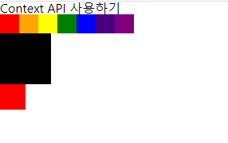

> 위 예제는 다음 레포지토리에 저장되어있습니다.  
> 1. git clone https://github.com/simsimjae/react_practice.git  
> 2. get reset --hard 6425494561510d85fc7fb098ba4256e1d59f2fbd  
> 3. yarn start or npm run start 실행

# 서론
이전 버전에서는 리액트만으로 상태관리하기가 굉장히 힘들었다.  부모와 자식간의 상태 교환만 가능했기 때문에 프로젝트 규모가 커질 수록 상태관리가 어려워 유지보수 하기가 점점 어려워진다.

이걸 극복하기 위해서 `Redux`나 `Mobx`를 사용하는데 이런 상태관리 라이브러리들의 기반이 되는 리액트의 `Context API`를 살펴보자.
리액트 16.3 이후 버전부터 이 `Context API`가 사용하기 쉽게 개편됬다고 한다.

그래서, 지금은 단순히 전역상태 관리만 필요한 프로젝트라면 리덕스를 굳이 쓰지 않아도 괜찮은것같지만, 나중에 비동기 처리를 하게 될지도 모르기 때문에 그냥 처음부터 리덕스를 쓰는게 나은것같다.(개인적인 의견)

# 정적 Context 사용해보기
### `src/contexts/color.js`

먼저 저장창고 역할을 하는 Context를 만들어보자.

```jsx
const ColorContext = createContext({ color: "black" }); // 저장창고(Context)에 검정색 저장
```

### `src/components/App.js`

```jsx
<ColorContext.Provider value={{ color: "red" }}>
	<div>
		<ColorBox />
	</div>
</ColorContext.Provider>
```

원래 색상 저장 창고에는 검정색이 들어있었다. 그런데, 판매자 `Provider`씨는 color를 red로 바꿔버렸다.
판매자가 갑이기 때문에 색깔을 빨간색으로 바꾸면 구매자는 그 바뀐 빨간색을 살 수 밖에없다.
여기서 소비자는 `ColorBox`이다. 판매자는 `ColorContext.Provider`이다.

__Provider가 변경한 정보(value={}부분)는 Provider의 자식들(ColorBox)에게 모두 영향을 미친다.__


### `src/components/ColorBox.js`

```jsx
const ColorBox = () => {
	return 
		<ColorContext.Consumer>
			{
				({ color }) => 
					<div style={{ width: "64px", height: "64px", background: color }}></div>
			}
		</ColorContext.Consumer>;
};
```

저장창고에 들어있는 색상을 꺼내온다.
`Consumer(소비자)`는 `Provider(판매자)`가 저장창고에서 꺼낸 색상을(기본은 검정색인데, 판매자가 방금 빨간색으로 바꿈) 구매해서 `div` 박스에 페인트칠을 한다.

# 동적 Context 사용하기
> git reset --hard ffa88aa070b4fd87424e9e552b6815fdf3059612


위에 빨주노초파남보중 하나를 왼쪽 클릭하면 아래에 큰 상자의(기본 검정색) 색깔이 바뀌고 오른쪽 클릭하면 맨아래 작은 상자(기본 빨간색)의 색깔이 바뀌는 예제이다.

탑다운방식으로 살펴보자.

### `src/App.js`

```jsx
<ColorProvider>
	<div>
		<SelectColors />
		<ColorBox />
	</div>
</ColorProvider>
```

컬러 판매자(`Color Provider`)는 `SelectColors`와 `ColorBox`에게 색상을 판매하려고한다.

### `src/contexts/color.js`
```jsx
const ColorContext = createContext({
	state: { color: "black", subColor: "red" },
	actions: {
		setColor: () => {},
		setSubColor: () => {}
	}
});
// 색깔 저장소에는 두가지 컬러가 들어있고, 두가지 색상을 변경시킬수 있는 함수가 들어있다.

const ColorProvider = ({ children }) => {
	const [color, setColor] = useState("black");
	const [subColor, setSubColor] = useState("red");

	const context = {
		state: { color, subColor },
		actions: { setColor, setSubColor }
	};

	return <ColorContext.Provider value={context}>{children}</ColorContext.Provider>;
};
// 색깔 판매자의 상태와 창고의 상태(context)는 일치한다.
// 색깔 판매자로 감싸진 자식들(children)은 판매자 Provider가 제공하는 창고정보(context)에 접근이 가능해진다.
// Provider의 상태를 바꿔주면 창고의 상태도 같이 바뀐다.

const ColorConsumer = ColorContext.Consumer;

export { ColorProvider, ColorConsumer };
// 내보내진 ColorConsumer를 사용하면 Provider가 props로 context(창고)를 내려준다.
// 내보내진 ColorProvider를 사용하면 value="" 부분에 객체를 넣어서 context(창고)를 수정할 수 있다.

export default ColorContext;
```
컬러 판매자 `Provider`는 창고에 두가지 색상(검정색, 빨간색)을 미리 준비해뒀다.  
그리고 창고의 상태와 `Provider`의 상태를 일치시킨다. 다시말해서, __Provider가 가진 색상 정보가 변경되면 창고의 색상 정보도 같이 변경되게끔 구성했다.__

`children`에는 Provider로 감싸진 `SelectColors`와 `ColorBox`가 들어오게 된다.  
이 두명의 소비자는 `Provider`가 제공하는 창고의 정보 `context`에 접근할 수 있으며 창고에 있는 색상을 변경시키는 `setColor`와 `setSubColor`도 사용할수있다.

그리고 나서 창고파일(color.js)에서 Provider, Consumer, Context 3개를 내보내준다.

### `src/components/SelectColors.js`

```jsx
<ColorConsumer>
	{context => (
		<div style={{ display: "flex" }}>
			{colors.map(color => (
				<div
					key={color}
					style={{ background: `${color}`, width: "24px", height: "24px", display: "inline-block", cursor: "pointer" }}
					onClick={() => {
						context.actions.setColor(color);
					}}
					onContextMenu={e => {
						e.preventDefault();
						context.actions.setSubColor(color);
					}}
				>
				</div>
			))}
		</div>
	)}
</ColorConsumer>
```

색상 구매자 `SelectColors`는 어떤색을 구매할지 결정하기 위해서 색상 판매자 `Provider`로부터 색상 창고(`context`)를 구경하기로 했다.

마우스 왼쪽클릭시, Provider로 부터 전달받은 context에 접근해서 Provider가 갖고 있는 컬러 정보를 바꿔준다. 
Provider와 창고(context)의 상태는 일치시켜져있기 때문에 Provider의 상태를 바꾸면 Context의 상태도 같이 바뀐다.

마우스 우클릭시, Provider가 갖고 있는 두번째 컬러값이 변경된다.
