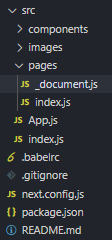

요즘 SPA를 만들기 위한 많은 라이브러리와 프레임워크들이 있지만 대부분 러닝커브가 크다.
SEO와 UX를 위해서 서버사이드 렌더링도 배워야 한다.

__그래서 우리는 간단하지만 커스텀가능한 Next.js를 개발했다.__

# next 사용 조건 및 특징

1. next를 사용하기 위해서는 `pages/index.js`와 같은 파일에서 리액트 컴포넌트를 default로 export해야한다.
2. next는 웹팩의 HMR을 사용해서 페이지를 핫 리로딩한다.
3. a태그를 사용해서 라우팅하면 브라우저는 서버로 요청을 보낸다.(클라이언트 사이드 라우팅 X)
4. 대신 next/link의 Link 컴포넌트를 사용하자.
5. Link 컴포넌트는 알아서 브라우저의 History API를 처리해주기 떄문에 개발자가 히스토리 관리를 하지 않아도 되서 편리하다.
6. Link 컴포넌트는 단순히 Wrapper 컴포넌트이기 때문에 href외의 다른 props는 먹히지 않는다. title과 같은 속성은 a태그에 직접 주어야 한다.

# next의 pages

pages 디렉토리의 .js나 .ts파일에서 React 컴포넌트를 내보내면 그 컴포넌트가 해당 페이지에 렌더링 된다.
예를들어서, pages/about.js로 부터 내보내진 리액트 컴포넌트는 주소창에서 /about이 입력됬을때 보여진다.

# Pre-rendering
넥스트에서 프리렌더링기능은 기본적으로 활성화 되어 있다. 프리렌더링은 다음과 같이 두 종류가 있다.
1. Static Generation
2. Server-side rendering

각 페이지별로 빌드 타임에 정적 파일을 만들것인지(`Static Generation`), 필요할때 서버에서 정적 파일을 만들게 할지 정할수있다.(`On-Demand`)

빌드타임이든 서버사이드 렌더링이든 어쩄든 html 파일이 만들어지고 나면 자바스크립트를 실행해서 현재 주소에 맞는 컴포넌트를 렌더링한다.
컴포넌트가 렌더링 되고 나면 `hydration`과정이 일어나게 된다.

## hydration이란?
브라우저가 html파일을 렌더링 하고 나면 이번에는 리액트가 컴포넌트 트리를 구성할 차례이다. 이 과정을 hydration이라고 한다.
(동적인 어떤것을 정적인 상태로 저장한뒤(`html`), 이것을 다시 동적인 상태로(`리액트 컴포넌트 트리`) 되돌리는 행위를 hydration이라고 한다.)

`hydration`과정이 끝나고 나면 리액트의 이벤트 핸들러가 부착 된다.

# Static Generation

`next build`커맨드를 입력하면 정적인 페이지가 빌드된다.
어떤 페이지가 데이터에 따라서 그때그떄 달라지지 않는다면 next는 페이지를 `pre-render`한다.(빌드 타임에 미리 생성해둔다.)
이렇게 했을떄 CDN에 정적인 페이지를 올려두기만 하면 접근이 가능해지는 장점이 생긴다.

```js
function HomePage() {
  return <div>Welcome to Next.js!</div>
}

export default HomePage
```
위 리액트 컴포넌트를 포함하는 페이지는 동적인 데이터를 요구하지 않기 떄문에 next는 이 페이지를 `pre-render`한다.
`pre-render`한다는 뜻은, 빌드타임에 미리 html 페이지를 생성해둔다는 뜻이다.

# Server-Side Rendering
```js
import fetch from 'isomorphic-unfetch'

function HomePage({ stars }) {
  return <div>Next stars: {stars}</div>
}

HomePage.getInitialProps = async ({ req }) => {
  const res = await fetch('https://api.github.com/repos/zeit/next.js')
  const json = await res.json()
  return { stars: json.stargazers_count }
}

export default HomePage
```
위 코드를 보자. getInitialProps를 통해서 데이터를 가져오고 있다. 이 함수가 리턴될때까지 페이지는 렌더링 되지 않는다.
유저가 사이트에 접속할때 데이터를 가져오기 때문에 유저는 항상 최신의 데이터를 볼 수 있다.
이렇게 getInitialProps로 데이터를 요청하는것은 렌더링을 block한다는 뜻에서 `blocking data requirement`라고 불린다.

`pre-render`된 html 페이지보다 `SSR`이 항상 최신 데이터를 불러올 수 있다는 장점은 있지만 대신에, 좀 더 렌더링이 늦을수밖에 없다.

# Routing

## Index routes
`pages/index.js` -> `/`  
`pages/blog/index.js` -> `/blog`

이와 같이 pages 폴더 아래에 있는 파일명에 따라서 next가 자동으로 라우팅 해주기 때문에 굉장히 편리하다.

## Nested Routes

폴더를 중첩해도 라우팅에 그대로 반영된다.

`pages/blog/first-post.js` → `/blog/first-post`  
`pages/dashboard/settings/username.js` → `/dashboard/settings/username`  

## Dynamic route segments
`pages/blog/1.js` 라는 파일이 있다고 해보자. 이 파일은 `/blog/:slug` 동적 라우팅을 통해서 :slug 변수로 파일명(1)을 가져올수있다.